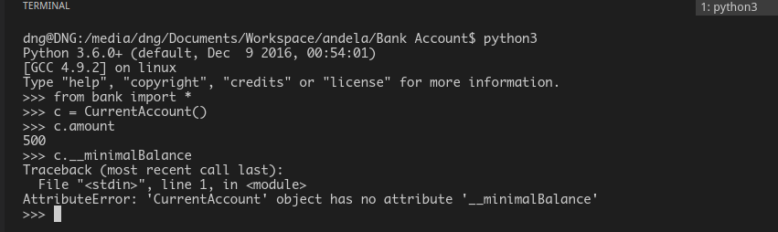

# PROJECT

This is a project that defines basic OOP principles.

## Getting Started

On your terminal run the following

`git clone https://github.com/andela-gathondu/Bank-Account.git`

## Prerequisites

You should have python installed in your machine.
If you dont have python installed go to this link
    [Installing Python.](https://tutorial.djangogirls.org/en/python_installation/)

You should also have an editor installed, if not follow this link
[Installing sublime.](https://www.sublimetext.com/3)

## Principles explained

1. Open the directory where you have the project cloned.

2. The principles are as follows:

    * Class

       This depicts real life objects, more specifically nouns. e.g `Class Bank(object):`

    * Object

       This is described as an `instance` of a `Class`

    * Functions

       When a *block of code* that run together to perform a specific task are combined, they are reffered to
       as a `Function`. When this *block of code* is inside a class it's reffered to as a `Method` instead
       and define the *behaviour* of the *Class*.
       
       In `bank.py`,  `def deposit(self, amnt):`  is a method

    * Polymorphism

       This is when one method from a class is inherited by different classes and the method performs
       different tasks as defined by the inheriting method e.g in `bank.py` we have the `deposit` and
       `withdraw` methods being impelemneted differently.

    * Inheritance

      This is when a class aquires the attributes and properties of another class and in python
      this is achieved by stating which class to aquire from, the properties and attributes.
      In the `bank.py` we can see that `CurrentAccount` inherits from `Bank` using parenthesis as follows:
      ```python
      class CurrentAccount(Bank):
      ```

    * Encapsulation

      This means hiding implementation from the user. User should only know how to interact with a class but
      it's implementation is hidden. Its can be described as abstraction too. In the `bank.py` we have the
      `CurrentAccount` class that has an attribute `__minimalBalance`.
      ```python
      class CurrentAccount(Bank):
           def __init__(self):
               self.__minimalBalance = 500
               self.amount = self.__minimalBalance
       ```

      but this attribute is known to the class
      alone and trying to access it raises an `AttributeError` as shown below:

      


## Built With

* [visual studio code](https://code.visualstudio.com/)
* [python 3.6](https://www.python.org/downloads/)